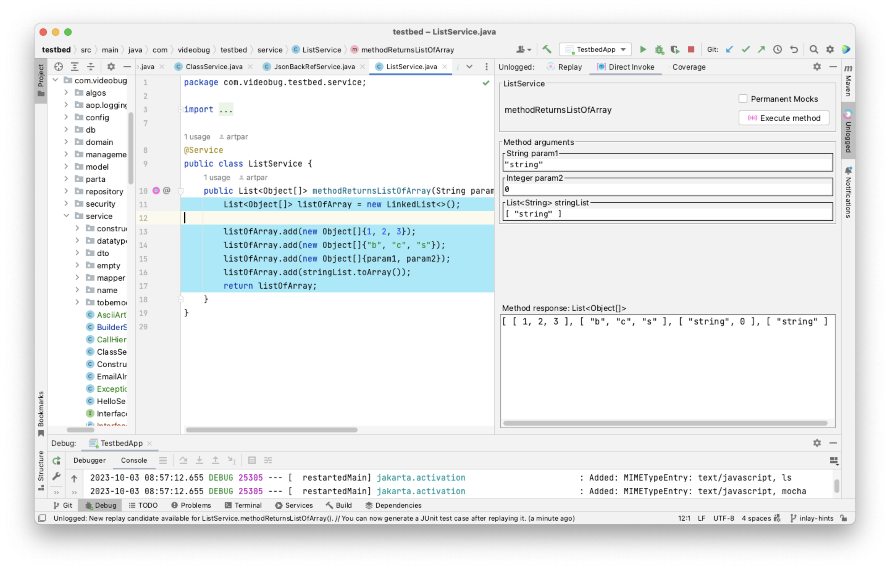
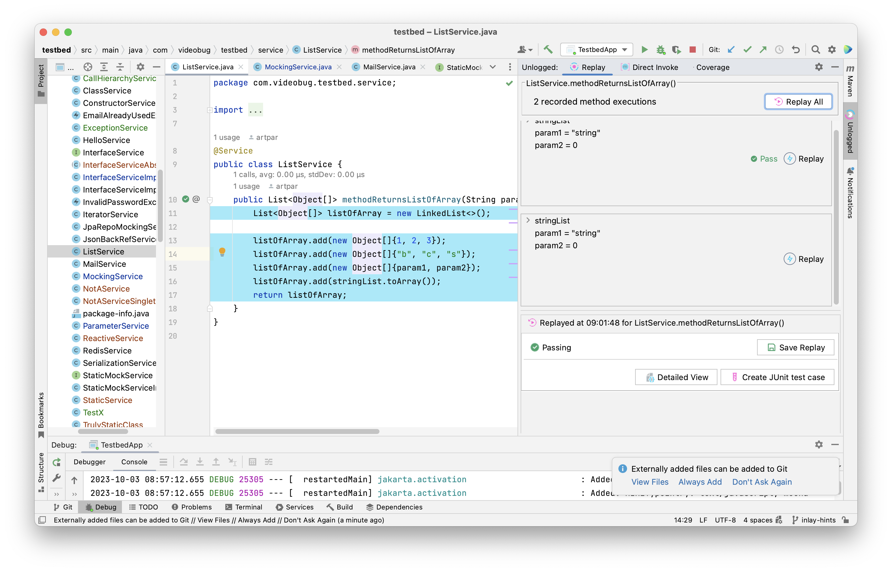
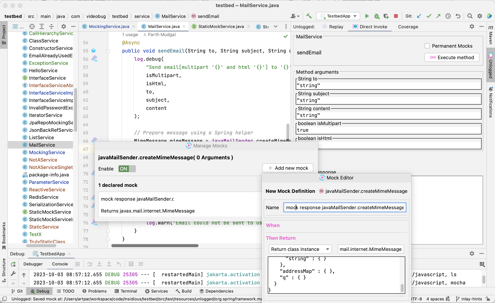
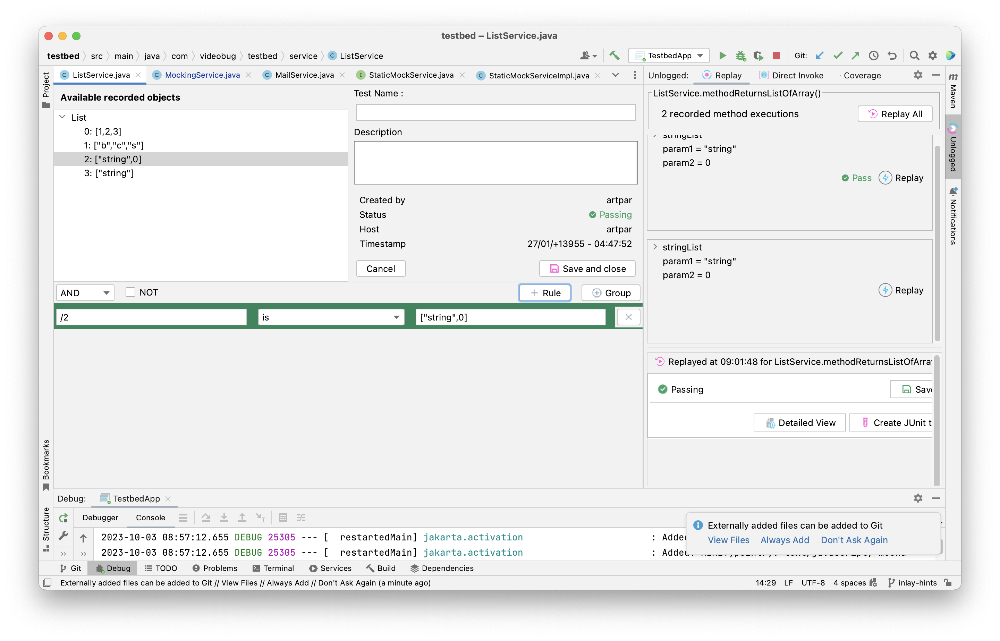
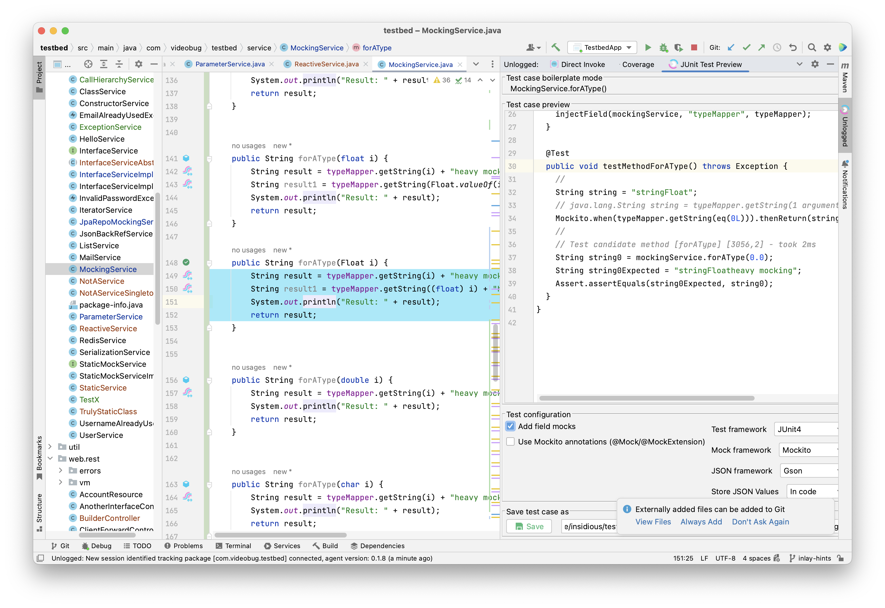

<p align="center">
  <a href="https://www.unlogged.io/">
    
  </a>
</p>

<p align="center">
  Record. Replay. Test.
</p>

<p align="center">
  <a href="https://unloggedio.github.io/documentation/"><strong>Documentation</strong></a> ·
  <a href="https://www.unlogged.io/bug-bounty-program"><strong>Bug Bounty</strong></a> ·
  <a href="https://mvnrepository.com/artifact/video.bug/unlogged-sdk/"><strong>Maven</strong></a> ·
  <a href="https://plugins.jetbrains.com/plugin/18529-unlogged"><strong>IntelliJ Plugin</strong></a>
</p>
<br/>


# Unlogged Java SDK

Unlogged Java SDK enabled recording of code execution in a binary format. 

Replay these records using the [Unlogged IntelliJ Plugin](https://plugins.jetbrains.com/plugin/18529-unlogged) and generate junit test cases.

The recording is highly detailed and can be used to reconstruct the code execution from scratch.
The [binary format descriptions](https://github.com/unloggedio/common/tree/master/src/main/kaitai) are available in Kaitai format here

- 🎬 Execute Java methods in your process right from your IDE
- 🖥️ Replay one or all recorded executions and see the differences in response in real time
- 🎯 Setup assertions on individual keys in response objects 
- 🎭 Mock downstream calls as easily as setting up a breakpoint
- 🩺 Identify bottlenecks in your code with perf numbers right above the method declaration
- 🦠 Create JUnit test cases from recorded executions

### Additional Screenshots

<details>
  <summary><b>🎬 Direct Invoke</b></summary>
  
</details>
<details>
  <summary><b>🖥️ Replay</b></summary>
  
</details>
<details>
  <summary><b>🎭 Mocking</b></summary>
  
</details>
<details>
  <summary><b>🎯 Assertions</b></summary>
  
</details>
<details>
  <summary><b>🦠 JUnit Test case</b></summary>
  
</details>


## Usage

1. Include dependency

### Maven
```xml
<dependencies>
    <dependency>
        <groupId>io.unlogged</groupId>
        <artifactId>unlogged-java-sdk</artifactId>
        <version>0.1.9</version>
    </dependency>
</dependencies>
```

### Gradle

```groovy
dependencies
{
    implementation 'video.bug:unlogged-sdk:0.1.9'
    annotationProcessor 'video.bug:unlogged-sdk:0.1.9'
}
```

2. Add `@Unlogged` annotation to your application entry point
```java
public class Main {
    @Unlogged
    public static void main(String[] args) {
        // 
    }
}
```

## Disabling unlogged-sdk

It is highly recommended that you disable the unlogged-sdk when deploying for usage. unlogged-sdk is only targetted 
for local usage only.

Adding the unlogged-sdk adds probes to your code which emits events in a binary format. Adding the `@Unlogged` 
enabled to actual execution of those probes.

### To disable at compile time

```bash
mvn package -Dunlogged.disable
```

or 

```bash
./gradlew build -Dunlogged.disable
```

### To disable at runtime (if not disabled at compile time)

```java
@Unlogged(enable = false)
```

You can find the latest release version here: https://mvnrepository.com/artifact/video.bug/unlogged-sdk


## Contributing

We welcome all contributions! There's many ways to contribute to the project,
including but not limited to:

- Opening a PR
- [Submitting feature requests or bugs](https://github.com/unloggedio/unlogged-sdk/issues/new)
- Improving our product or contribution documentation
- Voting on [open issues](https://github.com/unloggedio/unlogged-sdk/issues) or
  contributing use cases to a feature request

Lombok License

```java
/*
 * Copyright (C) 2009-2018 The Project Lombok Authors.
 *
 * Permission is hereby granted, free of charge, to any person obtaining a copy
 * of this software and associated documentation files (the "Software"), to deal
 * in the Software without restriction, including without limitation the rights
 * to use, copy, modify, merge, publish, distribute, sublicense, and/or sell
 * copies of the Software, and to permit persons to whom the Software is
 * furnished to do so, subject to the following conditions:
 *
 * The above copyright notice and this permission notice shall be included in
 * all copies or substantial portions of the Software.
 *
 * THE SOFTWARE IS PROVIDED "AS IS", WITHOUT WARRANTY OF ANY KIND, EXPRESS OR
 * IMPLIED, INCLUDING BUT NOT LIMITED TO THE WARRANTIES OF MERCHANTABILITY,
 * FITNESS FOR A PARTICULAR PURPOSE AND NONINFRINGEMENT. IN NO EVENT SHALL THE
 * AUTHORS OR COPYRIGHT HOLDERS BE LIABLE FOR ANY CLAIM, DAMAGES OR OTHER
 * LIABILITY, WHETHER IN AN ACTION OF CONTRACT, TORT OR OTHERWISE, ARISING FROM,
 * OUT OF OR IN CONNECTION WITH THE SOFTWARE OR THE USE OR OTHER DEALINGS IN
 * THE SOFTWARE.
 */
```
